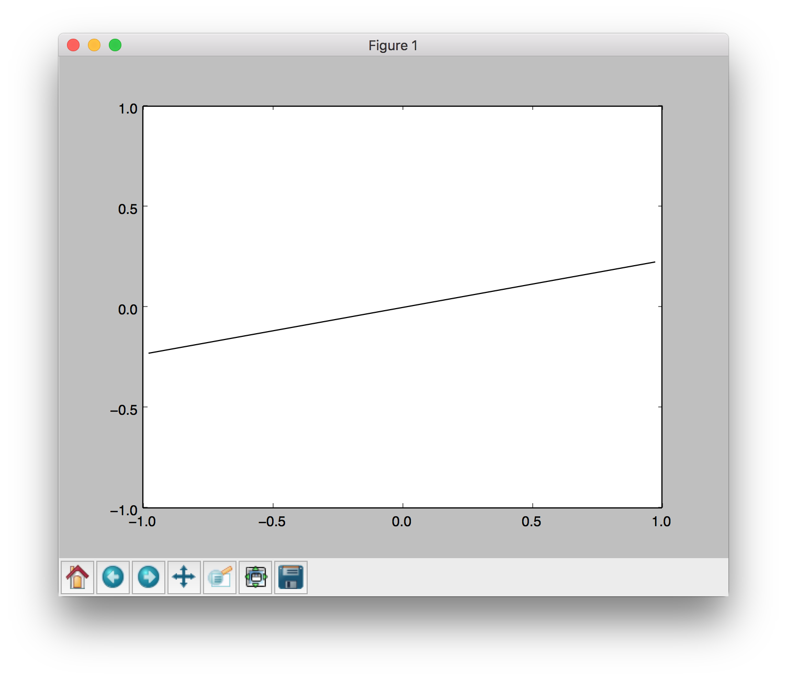

# a4-neural-network

Assignment 4: Introduction to neural network

# Installation

For this project, you will need to install the following two libraries:

* `numpy`, which provides support for large multi-dimensional arrays
* `matplotlib`, a 2D plotting library

### CONDA

```python
conda activate [your environment name]
conda install -c anaconda numpy
conda install -c conda-forge matplotlib
```

### PIP
```python
pip install numpy
pip install matplotlib
```
### To test that everything has been installed, run:
```python
python autograder.py --check-dependencies
```
If numpy and matplotlib are installed correctly, you should see a window pop up where a line segment spins in a circle:



# Introduction

Files to Edit and Submit: You will fill in portions of `models.py` during the assignment.
Please do not change the other files in this distribution.

|        |           |
| ------------- |-------------|
| **Files you'll edit:**  |
|`models.py`  | Perceptron and neural network models for a variety of applications |
| **Files you should read but *NOT* edit:**     |
| `nn.py`      |   Neural network mini-library |
| **Files you will *not* edit:** |
|  `backend.py` | Backend code for various machine learning tasks
|   `autograder.py` | Project autograder

To test your implementation, run the autograder in command line:
```python
python autograder.py -q q1
python autograder.py -q q2
python autograder.py -q q3
```

Your grade will most likely correspond to the reported score on the auto-grader (we will use our own auto-grader code that mirrors what you are provided).

**Important**: Marks will be deducted for poor code quality. Anywhere from 1-3pt per problem, depending on the severity of the issues. Please use comments where it makes sense, and try to keep your code clear and easy for the TAs to understand.

**Note**: Read [Neural Network Tips](#neural-network-tips) and [Tutorial](#tutorial-on-neural-network-mini-library) before attempting the question.

# Question 1 (3 points): Perceptron

In this part, you will implement a binary perceptron. Your task will be to complete the implementation of the
`PerceptronModel` class in `models.py`.

For the perceptron, the output labels will be either 1 or −1 ,
meaning that data points `(x, y)` from the dataset will have `y` be a nn.Constant node that contains
either 1 or −1 as its entries.

We have already initialized the perceptron weights `self.w` to be a **1 × dimensions**
 parameter node. The provided code will include a bias feature inside `x` when needed,
so you will not need a separate parameter for the bias.

Your tasks are to:
1. Implement the `run(self, x)` method.
  This should compute the dot product of the stored weight vector and the given input,
  returning an nn.DotProduct object.

2. Implement `get_prediction(self, x)`, which should return 1 if the dot product is non-negative or −1
 otherwise. You should use nn.as_scalar to convert a scalar Node into a Python floating-point number.
Write the train(self) method. This should repeatedly loop over the data set and make updates on examples

3. Write the `train(self)` method. This should repeatedly loop over the data set and make updates on examples
   that are misclassified. Use the update method of the nn.Parameter class to update the weights.
   When an entire pass over the data set is completed without making any mistakes,
   **100% training accuracy** has been achieved, and training can terminate.

In this project, the only way to change the value of a parameter is by calling ```parameter.update(direction, multiplier)```, 
which will perform the update to the weights:
```
weights ← weights + direction ⋅ multiplier
```
The ```direction``` argument is a ```Node``` with the same shape as the parameter, and the ```multiplier``` argument is a Python scalar.

**Note**: the autograder should take **at most 20 seconds** or so to run for a correct implementation. 
If the autograder is taking forever to run, your code probably has a bug.

# Question 2 (4 points): Non-linear Regression

For this question, you will train a neural network to approximate sin(x) over [−2π , 2π]

You will need to complete the implementation of the `RegressionModel` class in `models.py`.
For this problem, a relatively simple architecture should suffice (see Neural Network Tips for architecture tips.
Use `nn.SquareLoss` as your loss.

1. Implement `RegressionModel.__init__` with any needed initialization
2. Implement `RegressionModel.run` to return a batch_size × 1 node that represents your model’s prediction.
3. Implement `RegressionModel.get_loss` to return a loss for given inputs and target outputs.
4. Implement `RegressionModel.train`, which should train your model using gradient-based updates.

 Your implementation will receive full points if it gets a loss of 0.02 or better,
 averaged across all examples in the dataset.
 You may use the training loss to determine when to stop training
 (use nn.as_scalar to convert a loss node to a Python number).
 Note that it should take the model a few minutes to train.

# Question 3 (5 points): Digit Classification


For this question, you will train a network to classify handwritten digits from the MNIST dataset.

Each digit is of size 28 × 28 pixels, the values of which are stored in a **784-dimensional** vector of floating point numbers.
Each output we provide is a **10-dimensional** vector which has zeros in all positions,
except for a one in the position corresponding to the correct class of the digit.

Complete the implementation of the `DigitClassificationModel class` in models.py.
The return value from `DigitClassificationModel.run()` should be a `batch_size × 10`
 node containing scores, where higher scores indicate a higher probability of a digit belonging to a particular class (0-9). You should use nn.SoftmaxLoss as your loss. Do not put a ReLU activation after the last layer of the network.

In addition to training data, there is also validation data and a test set.
You can use `dataset.get_validation_accuracy()` to compute validation accuracy for your model,
which can be useful when deciding whether to stop training. The test set will be used by the autograder.

To receive points for this question, your model should achieve an accuracy of at least 97% on the test set.
For reference, our implementation consistently achieves an accuracy of near 98% on the validation data after training for around 10-15 epochs.
Note that the test grades you on **test accuracy**, while you only have access to **validation accuracy** -
so if your validation accuracy meets the 97% threshold,
you may still fail the test if your test accuracy does not meet the threshold.
Therefore, it may help to set a slightly higher stopping threshold on validation accuracy, such as 97.5% or 98%.


# Neural Network Tips
### Building Neural Nets
Throughout the applications portion of the project, 
you’ll use the framework provided in nn.py to create neural networks to solve a variety of machine learning problems. 
A simple neural network has layers, where each layer performs a linear operation (just like perceptron). 
Layers are separated by a non-linearity, which allows the network to approximate general functions. 
We’ll use the ReLU operation for our non-linearity, defined as ```relu(x) = max(x,0)```. 
 For example, a simple two-layer neural network for mapping an input row vector 
```x``` to an output vector ```f(x)``` would be given by the function:
```
f(x) = relu(x ⋅ W1 + b1) ⋅ W2 + b2
```
where we have parameter matrices W1 and W2 and parameter vectors b1 and b2 to learn during gradient descent. 
```W1``` will be an ``i × h`` matrix, where ```i``` s the dimension of our input vectors ```x``` , and ```h``` is the hidden layer size. 
```b1``` will be a size ```h``` vector. We are free to choose any value we want for the hidden size (
we will just need to make sure the dimensions of the other matrices and vectors agree so that we can perform the operations). 
Using a larger hidden size will usually make the network more powerful (able to fit more training data), 
but can make the network harder to train (since it adds more parameters to all the matrices and vectors we need to learn), 
or can lead to overfitting on the training data. 

We can also create deeper networks by adding more layers, for example a three-layer net:
```
f(x) = relu( relu(x ⋅ W1 + b1) ⋅ W2 + b2) ⋅ W3 + b3
```

### Note on Batching For efficiency, 
you will be required to process whole batches of data at once rather than a single example at a time. 
This means that instead of a single input row vector ```x``` with size ```i``` , 
you will be presented with a batch of ```b``` inputs represented as a ```b × i``` matrix ```X``` . 
We provide an example for linear regression to demonstrate how a linear layer can be implemented in the batched setting.

### Note on Randomness
The parameters of your neural network will be randomly initialized, 
and data in some tasks will be presented in shuffled order. Due to this randomness, 
it’s possible that you will still occasionally fail some tasks even with a strong architecture – this is the problem of local optima! 
This should happen very rarely, though – if when testing your code you fail the autograder twice in a row for a question, 
you should explore other architectures.

### Practical tips
* Be systematic. Keep a log of every architecture you’ve tried, what the hyperparameters (layer sizes, learning rate, etc.) were, and what the resulting performance was. As you try more things, you can start seeing patterns about which parameters matter. If you find a bug in your code, be sure to cross out past results that are invalid due to the bug.
* Start with a shallow network (just two layers, i.e. one non-linearity). Deeper networks have exponentially more hyperparameter combinations, and getting even a single one wrong can ruin your performance. Use the small network to find a good learning rate and layer size; afterwards you can consider adding more layers of similar size.
* If your learning rate is wrong, none of your other hyperparameter choices matter. You can take a state-of-the-art model from a research paper, and change the learning rate such that it performs no better than random. A learning rate too low will result in the model learning too slowly, and a learning rate too high may cause loss to diverge to infinity. Begin by trying different learning rates while looking at how the loss decreases over time.
* Smaller batches require lower learning rates. When experimenting with different batch sizes, be aware that the best learning rate may be different depending on the batch size.
* Refrain from making the network too wide (hidden layer sizes too large) If you keep making the network wider accuracy will gradually decline, and computation time will increase quadratically in the layer size – you’re likely to give up due to excessive slowness long before the accuracy falls too much. The full autograder for all parts of the project takes 2-12 minutes to run with staff solutions; if your code is taking much longer you should check it for efficiency.
* If your model is returning Infinity or NaN, your learning rate is probably too high for your current architecture.
* Recommended values for your hyperparameters:
    * Hidden layer sizes: between 10 and 400.
    * Batch size: between 1 and the size of the dataset. For Q2 and Q3, we require that total size of the dataset be evenly divisible by the batch size.
    * Learning rate: between 0.001 and 1.0.
    * Number of hidden layers: between 1 and 3.

# Tutorial on Neural network mini library
For this project, you have been provided with a neural network mini-library (`nn.py`) and a collection of datasets (`backend.py`).

The library in `nn.py` defines a collection of node objects. Each node represents a real number or a matrix of real numbers.
Operations on node objects are optimized to work faster than using Python’s built-in types (such as lists).

Here is a full list of nodes available in nn.py
* `nn.Constant` represents a matrix (2D array) of floating point numbers.
  It is typically used to represent input features or target outputs/labels.
  Instances of this type will be provided to you by other functions in the API;
  you will not need to construct them directly.

* `nn.Parameter` represents a trainable parameter of a perceptron or neural network.
  * Usage: `nn.Parameter(n, m)` constructs a parameter with shape `n × m`

* `nn.DotProduct` computes a dot product between its inputs.
  * **Do not** use `nn.DotProduct` for any model other than the perceptron.
  * Here is an example of computing a dot product of x with itself, first as a node and then as a Python number.
    ```python
    >>> nn.DotProduct(x, x)
    <DotProduct shape=1x1 at 0x11a89edd8>
    >>> nn.as_scalar(nn.DotProduct(x, x))
    1.9756581717465536
    ```

* `nn.Add` adds matrices element-wise
    * Usage: `nn.Add(x, y)` accepts two nodes of shape batch_size × num_features and constructs a node that also has shape `batch_size × num_features`.

* `nn.AddBias` adds a bias vector to each feature vector.
  * Usage: `nn.AddBias(features, bias)` accepts features of shape batch_size × num_features and biasof shape `1 × num_features` ,
    and constructs a node that has shape `batch_size × num_features`.

* `nn.Linear` applies a linear transformation (matrix multiplication) to the input
  * Usage: `nn.Linear(features, weights)` accepts `features` of shape `batch_size × num_input_features` and `weights` of shape
    `num_input_features × num_output_features` , and constructs a node that has shape `batch_size × num_output_features`.

* `nn.ReLU` applies the element-wise Rectified Linear Unit nonlinearity `relu(x)= max(x,0)`.
  This nonlinearity replaces all negative entries in its input with zeros.
  * Usage: `nn.ReLU(features)`, which returns a node with the same shape as the input.

* `nn.SquareLoss` computes a batched square loss, used for **regression problem**
  * Usage: `nn.SquareLoss(a, b)`, where a and b both have shape `batch_size × num_outputs`.

* `nn.SoftmaxLoss` computes a batched softmax loss, used for classification problems.
  * Usage: `nn.SoftmaxLoss(logits, labels)`, where `logits` and `labels` both have shape `batch_size × num_classes`.
    The term “logits” refers to scores produced by a model, where each entry can be an arbitrary real number.
    The labels, however, must be non-negative and have each row sum to 1. Be sure not to swap the order of the arguments!

The following methods are available in nn.py
* `nn.gradients` computes gradients of a loss with respect to provided parameters
  * Usage: `nn.gradients(loss, [parameter_1, parameter_2, ..., parameter_n])` will return a list `[gradient_1, gradient_2, ..., gradient_n]`,
    where each element is an nn.Constant containing the gradient of the loss with respect to a parameter.

* `nn.as_scalar` can extract a Python floating-point number from a node. This can be useful to determine when to stop training.
  * Usage: `nn.as_scalar(node)`, where node is either a loss node or has shape (1,1).

* How to iterate through dataset?
When training a perceptron or neural network, you will be passed a dataset object.
  You can retrieve batches of training examples by calling dataset.iterate_once(batch_size):
    ```python
    for x, y in dataset.iterate_once(batch_size):
        ...
    ```
  For example, let’s extract a batch of size 1 (i.e., a single training example) from the perceptron training data:
    ```python
    >>> batch_size = 1
    >>> for x, y in dataset.iterate_once(batch_size):
    ...     print(x)
    ...     print(y)
    ...     break
    ...
    <Constant shape=1x3 at 0x11a8856a0>
    <Constant shape=1x1 at 0x11a89efd0>
    ```
  The input features `x` and the correct label `y` are provided in the form of `nn.Constant` nodes.
  The shape of `x` will be `batch_size x num_features`, and the shape of `y` is `batch_size x num_outputs`.

* The datasets provided also have two additional methods:
  * `dataset.iterate_forever(batch_size)` yields an infinite sequences of batches of examples.
  * `dataset.get_validation_accuracy()` returns the accuracy of your model on the validation set. This can be useful to determine when to stop training.

### Example: Linear Regression
As an example of how the neural network framework works, let’s fit a line to a set of data points. 
We’ll start four points of training data constructed using the function ```y = 7 x_0 + 8 x_1 + 3``` . In batched form, our data is:


Suppose the data is provided to us in the form of ```nn.Constant nodes```:

```
>>> x
<Constant shape=4x2 at 0x10a30fe80>
>>> y
<Constant shape=4x1 at 0x10a30fef0>
```

Let’s construct and train a model of the form ```f(x) = x_0 ⋅ m_0 + x_1 ⋅ m_1 + b``` . 
If done correctly, we should be able to learn than m_0 = 7 , m_1 = 8 , and b = 3 . 
First, we create our trainable parameters. In matrix form, these are:


Which corresponds to the following code:
```python
m = nn.Parameter(2, 1)
b = nn.Parameter(1, 1)
```
Printing them gives:
```
>>> m
<Parameter shape=2x1 at 0x112b8b208>
>>> b
<Parameter shape=1x1 at 0x112b8beb8>
```
Next, we compute our model’s predictions for y:
```python
xm = nn.Linear(x, m)
predicted_y = nn.AddBias(xm, b)
```

Our goal is to have the predicted y-values match the provided data. In linear regression we do this by minimizing the square loss:


We construct a loss node:
```python
loss = nn.SquareLoss(predicted_y, y)
```
In our framework, we provide a method that will return the gradients of the loss with respect to the parameters:
```python
grad_wrt_m, grad_wrt_b = nn.gradients(loss, [m, b])
```

Printing the nodes used gives:
```
>>> xm
<Linear shape=4x1 at 0x11a869588>
>>> predicted_y
<AddBias shape=4x1 at 0x11c23aa90>
>>> loss
<SquareLoss shape=() at 0x11c23a240>
>>> grad_wrt_m
<Constant shape=2x1 at 0x11a8cb160>
>>> grad_wrt_b
<Constant shape=1x1 at 0x11a8cb588>
```
We can then use the update method to update our parameters. 
Here is an ```update``` for ```m```, assuming we have already initialized a ```multiplier``` variable based on a suitable learning rate of our choosing:
```python
m.update(grad_wrt_m, multiplier)
```
If we also include an update for ```b``` and add a loop to repeatedly perform gradient updates, we will have the full training procedure for linear regression.


